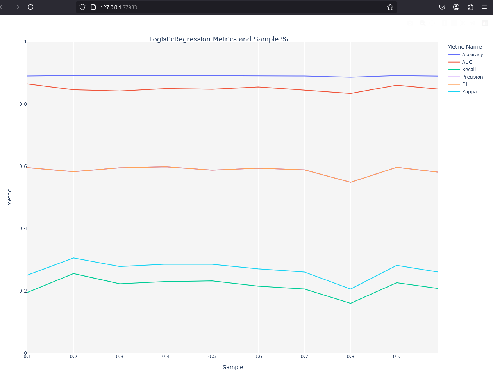

# 🧠 Analyse comparative des modèles avec PyCaret

Ce document décrit l'utilisation d'un script Python pour comparer automatiquement plusieurs modèles de classification à l'aide de la bibliothèque **PyCaret**.

## 📂 Fichier principal

```python
compare_models.py
```

## 🛠️ Prérequis

Avant d'exécuter le script, il est nécessaire d'avoir les bibliothèques suivantes installées dans votre environnement :

```bash
pip install pycaret==3.0.0
pip install scikit-learn==1.1.3
```

⚠️ **Important** : Certaines versions récentes de `scikit-learn` peuvent causer des erreurs de compatibilité avec PyCaret.

## 🧪 Jeu de données utilisé

Le jeu de données utilisé provient de :

```python
https://raw.githubusercontent.com/pycaret/pycaret/master/datasets/bank.csv
```

Il s'agit d'une base bancaire contenant des colonnes telles que :

- `age`, `job`, `marital`, `education`, etc.
- La variable cible est : `deposit` (oui/non).

## ⚙️ Étapes du traitement

1. 📥 **Chargement du dataset**
2. ⚙️ **Configuration de l'environnement PyCaret avec `setup()`**
3. 🤖 **Comparaison automatique des modèles avec `compare_models()`**
4. ✅ **Finalisation du meilleur modèle**
5. 💾 **Enregistrement du modèle (optionnel)**
6. 📋 **Extraction des résultats avec `pull()`**
7. 📤 **Exportation des résultats en CSV**

## 📌 Code complet

### 🔍 Explication ligne par ligne

```python
# Description: Comparer les modèles de classification en utilisant PyCaret
import pandas as pd
from pycaret.classification import setup, compare_models, finalize_model, pull, save_model

# Lire le dataset depuis une source en ligne
url = 'https://raw.githubusercontent.com/pycaret/pycaret/master/datasets/bank.csv'
dataset = pd.read_csv(url)

# Initialiser l'environnement PyCaret
clf1 = setup(dataset, target='deposit', train_size=0.6)

# Comparer plusieurs modèles automatiquement
best_model = compare_models(verbose=False)

# Finaliser le meilleur modèle (entraînement sur 100 % des données)
best = finalize_model(best_model)

# (Optionnel) Enregistrer le modèle
# save_model(best, 'model_depot_banque')

# Extraire le jeu de données préparé
dataset = pull()

# Exporter les résultats en fichier CSV
dataset.to_csv('resultats_prepares.csv', index=False)

# Afficher le meilleur modèle sélectionné
print(best)
```

### 🧾 Détail du script

```python
import pandas as pd
```
📌 Importe la bibliothèque `pandas` pour manipuler les données tabulaires.

```python
from pycaret.classification import setup, compare_models, finalize_model, pull, save_model
```
📌 Importe les fonctions principales de PyCaret pour les modèles de classification.

```python
url = 'https://raw.githubusercontent.com/pycaret/pycaret/master/datasets/bank.csv'
dataset = pd.read_csv(url)
```
📌 Charge un dataset CSV à partir d'une URL en utilisant `pandas.read_csv()`.

```python
clf1 = setup(dataset, target='deposit', train_size=0.6)
```
⚙️ Configure l'environnement PyCaret : 
- `dataset` est la base de données à analyser,
- `target='deposit'` est la variable à prédire,
- `train_size=0.6` utilise 60 % des données pour l'entraînement.

```python
best_model = compare_models(verbose=False)
```
🤖 Compare automatiquement plusieurs modèles de classification et retourne celui avec les meilleures performances globales.

```python
best = finalize_model(best_model)
```
✅ Réentraîne le meilleur modèle avec **100 % des données** disponibles.

```python
# save_model(best, 'model_depot_banque')
```
💾 (Optionnel) Enregistre le modèle final sur le disque local.

```python
dataset = pull()
```
📋 Récupère les données traitées après l’appel de `setup()`.

```python
dataset.to_csv('resultats_prepares.csv', index=False)
```
📤 Exporte les données traitées dans un fichier CSV.

```python
print(best)
```
🖨️ Affiche le modèle sélectionné avec ses hyperparamètres et son type.

---

## 📉 Résultats

La commande `compare_models()` retourne automatiquement le meilleur modèle basé sur des métriques telles que :

- Accuracy
- AUC
- Recall
- F1 Score
- Precision
- Kappa

### 📊 Graphique de performance



Ce graphique illustre les performances du modèle de **régression logistique** selon différentes proportions de l'échantillon d'entraînement (de 10 % à 100 %).

#### Interprétation des courbes :

- **Accuracy** et **AUC** sont les plus élevées et restent stables, ce qui montre que le modèle est **robuste** et **précis** sur les échantillons testés.
- **F1** est relativement stable mais plus basse (~0.59), ce qui indique un **équilibre correct** entre **précision** et **rappel**.
- **Recall** et **Kappa** sont plus faibles : cela suggère que le modèle a plus de mal à **identifier tous les cas positifs**.
- **Precision** est constante mais inférieure à l'Accuracy, ce qui veut dire qu’il y a quelques **faux positifs**.

> 📌 En résumé, le modèle est performant globalement mais pourrait être amélioré pour mieux détecter les vrais positifs (Recall).

## 🧰 Débogage

### ❌ Erreur fréquente :

```bash
AttributeError: 'Simple_Imputer' object has no attribute 'target_variable'
```

### ✅ Solution :
- Forcer la version `scikit-learn==1.1.3`
- Réinstaller PyCaret après correction

## ✅ Conclusion

Ce script permet d’identifier rapidement le meilleur modèle de classification sans avoir à coder chaque modèle manuellement. PyCaret est un outil puissant pour les **Data Scientists** et **analystes** qui souhaitent automatiser le Machine Learning.

> 🧠 *Astuce : utilisez un échantillon (`sample_size`) pour réduire le temps de calcul pendant les tests.*

---

🎉 Projet réalisé avec succès !

