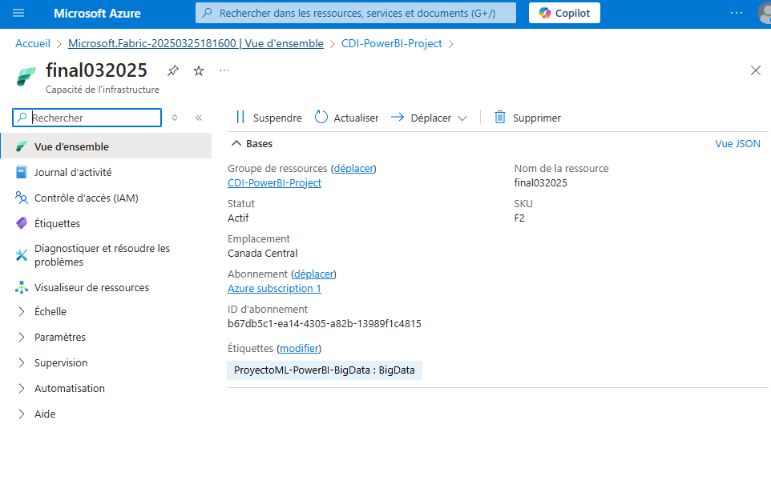
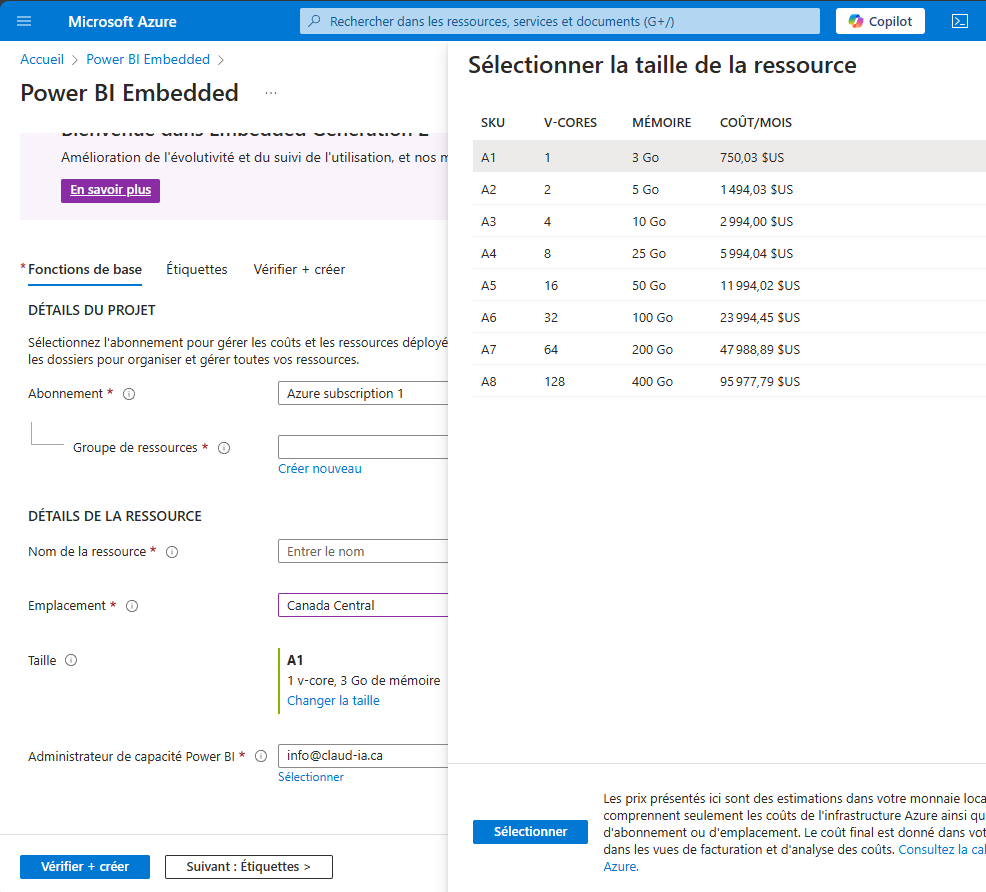
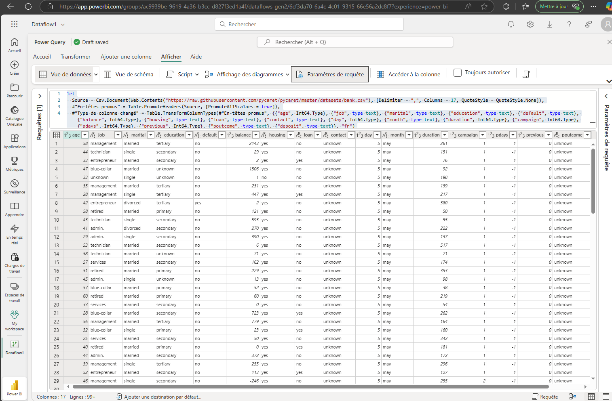
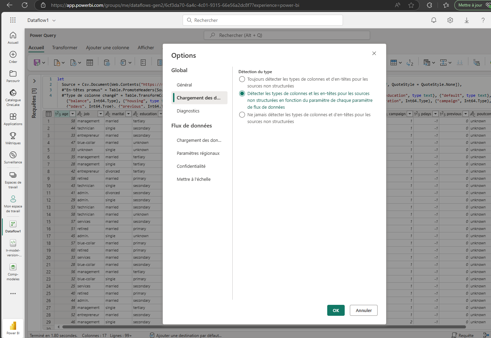
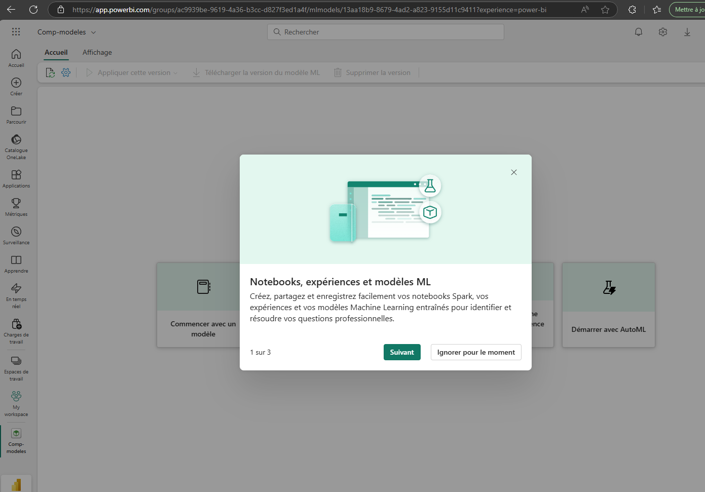
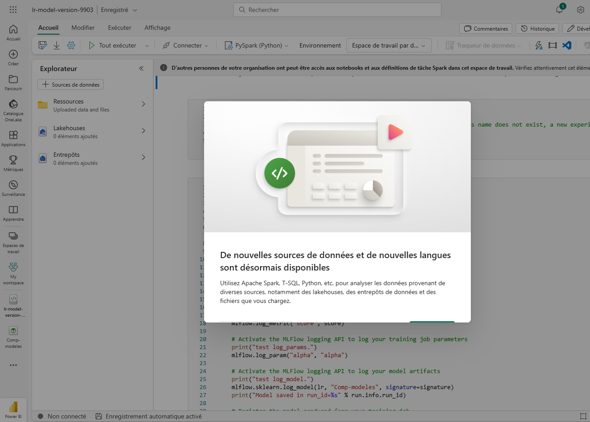
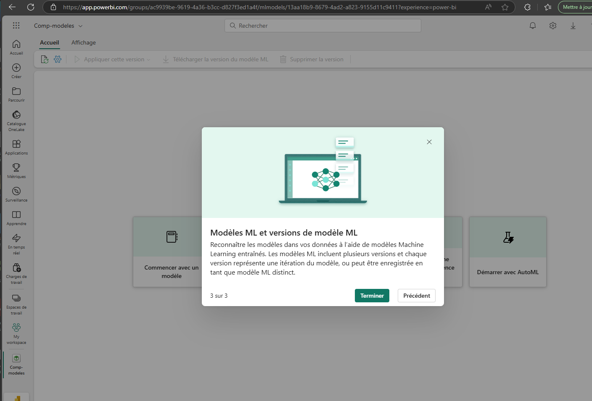
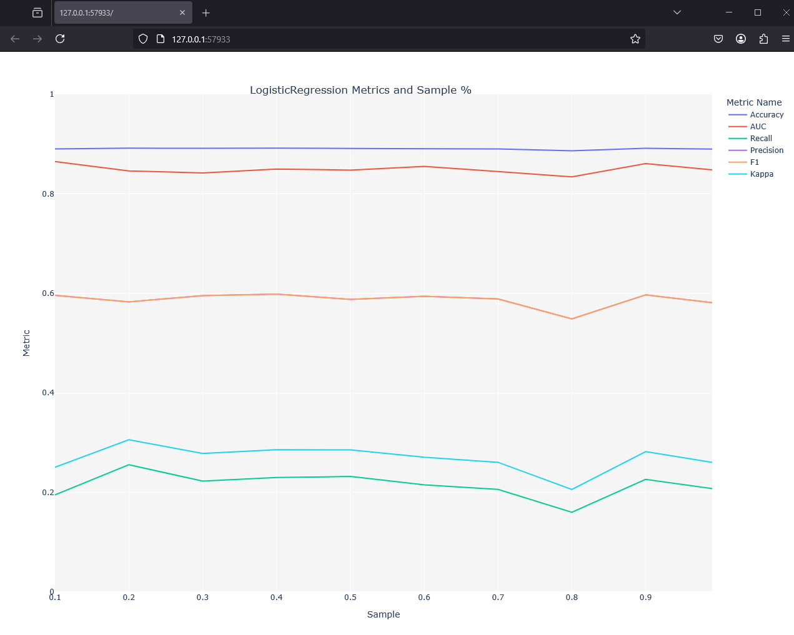

# Utilisation de Power BI Embedded Generation 2 avec Azure

Ce document décrit les étapes essentielles pour intégrer et utiliser **Power BI Embedded Generation 2** dans un projet Azure.

## 🌐 Introduction

Power BI Embedded Generation 2 offre une meilleure **scalabilité**, un suivi plus efficace de l'utilisation, et des performances accrues pour l'affichage et la gestion des rapports Power BI.

---

## 🚀 Déploiement du projet dans Azure

### 1. Création de la ressource Power BI Embedded

- Abonnement : Azure Subscription 1
- Groupe de ressources : CDI-PowerBI-Project
- Emplacement : Canada Central
- Nom de la ressource : `final032025`
- Taille : `A1` (1 v-core, 3 Go de mémoire)

> ⚠️ **Attention** : L'étape de validation peut échouer si certaines informations de base sont manquantes.

### 2. Détails de la ressource

- Statut : Actif
- Mode de ressource : Embedded Generation 2
- Administrateur : info@claud-ia.ca

### 3. Coûts mensuels estimés

La tarification varie selon la taille (SKU) choisie. Exemple :
- `A1` : 750,03 $US/mois
- `A2` : 1494,03 $US/mois
- `A8` : jusqu'à 95 977,79 $US/mois

---

## 📊 Intégration avec Power BI Service

### Chargement et transformation des données avec Power Query

Utilisation d'une source CSV externe, transformation des types de colonnes avec `Table.TransformColumnTypes`, gestion des entêtes, etc.

### Options de détection des types

- 🔹 **Option recommandée** : détecter les types de colonnes et entêtes pour les sources non structurées selon les paramètres du flux.

---

## 🧰 Machine Learning dans Power BI

### 1. Notebooks, expériences et modèles ML

- Création de notebooks Spark
- Enregistrement de modèles entrainés pour des cas professionnels

### 2. Sources de données et langages disponibles

- Intégration avec Apache Spark, T-SQL, Python
- Accès aux fichiers, entrepôts et lakehouses

### 3. Gestion des versions de modèles ML

- Plusieurs versions d'un modèle peuvent être enregistrées
- Chaque version correspond à une itération du modèle entrainé

### 4. Analyse de performance des modèles

- Métriques affichées : Accuracy, AUC, Recall, F1, etc.
- Comparaison sur différents échantillons de données

---

## 📄 Conclusion

La combinaison de Power BI Embedded Gen2 et Azure permet une intégration fluide de solutions d'analyse avancée avec Machine Learning. Elle offre aussi des possibilités d'automatisation et de gestion performantes des ressources cloud.

> 💡 Astuce : Surveillez les coûts régulièrement dans le portail Azure pour éviter des dépassements inattendus.

---

🎉 Projet réalisé avec succès !
