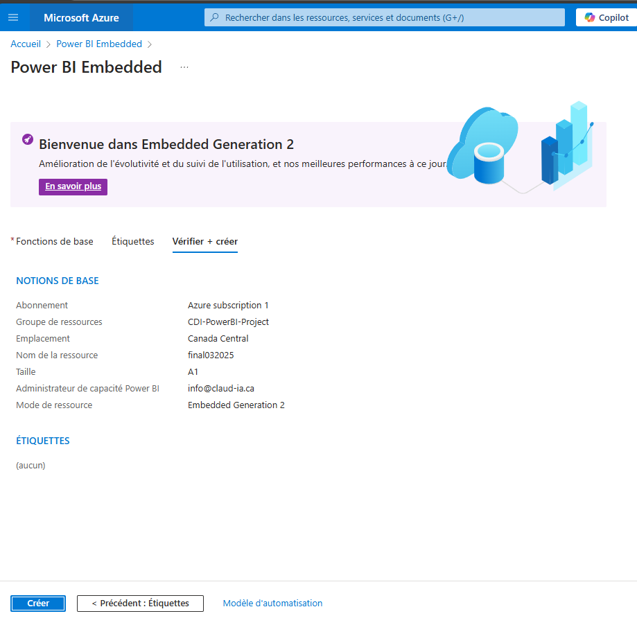
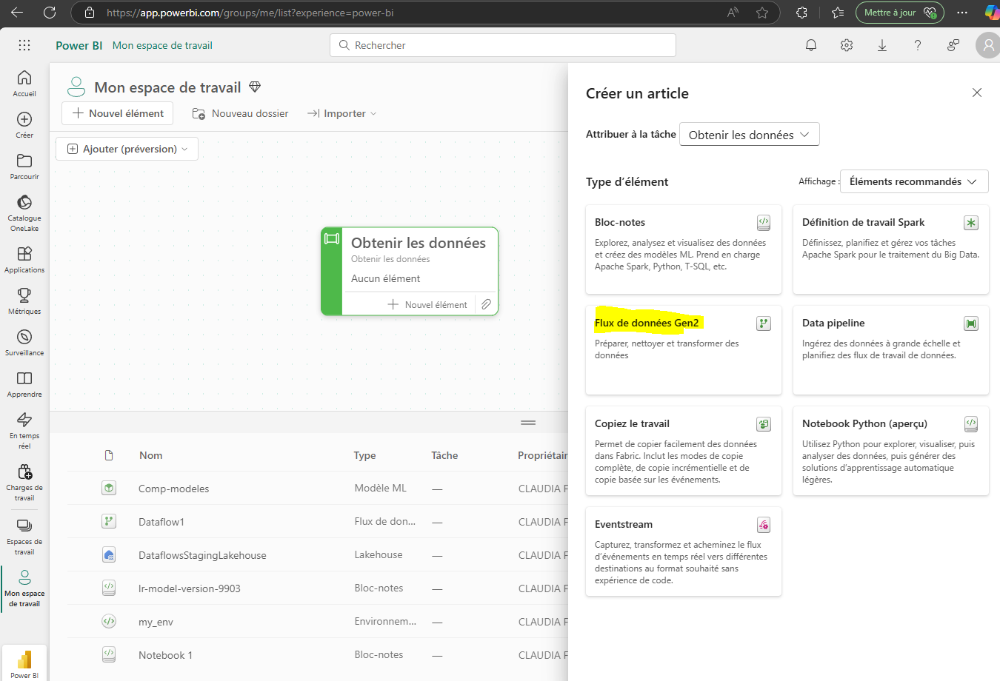
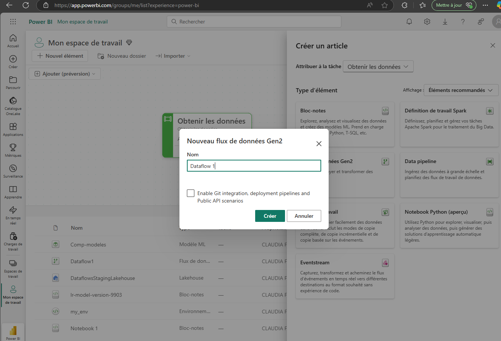
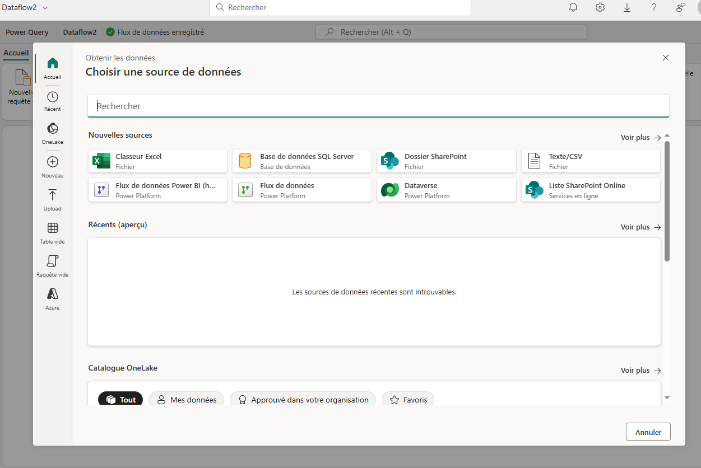
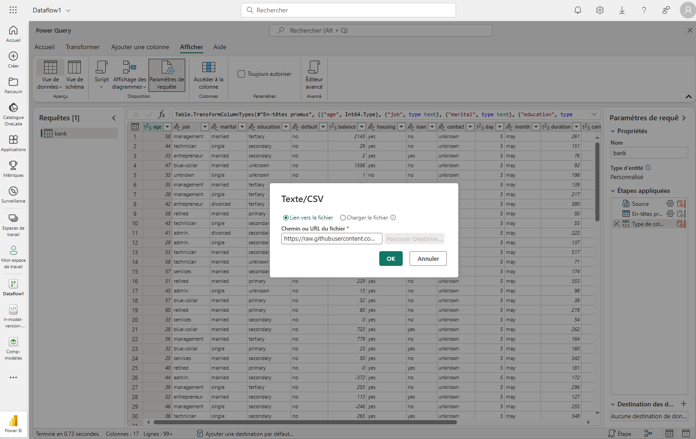
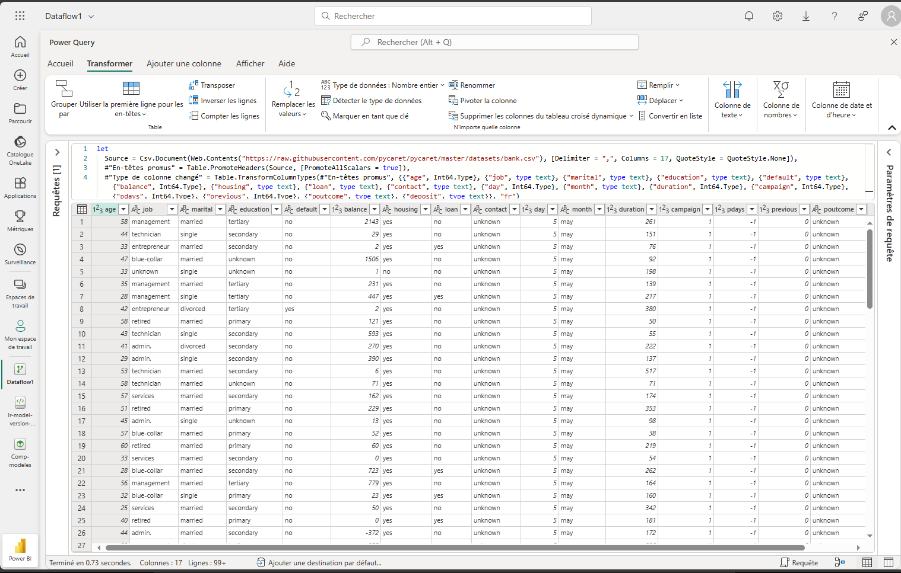
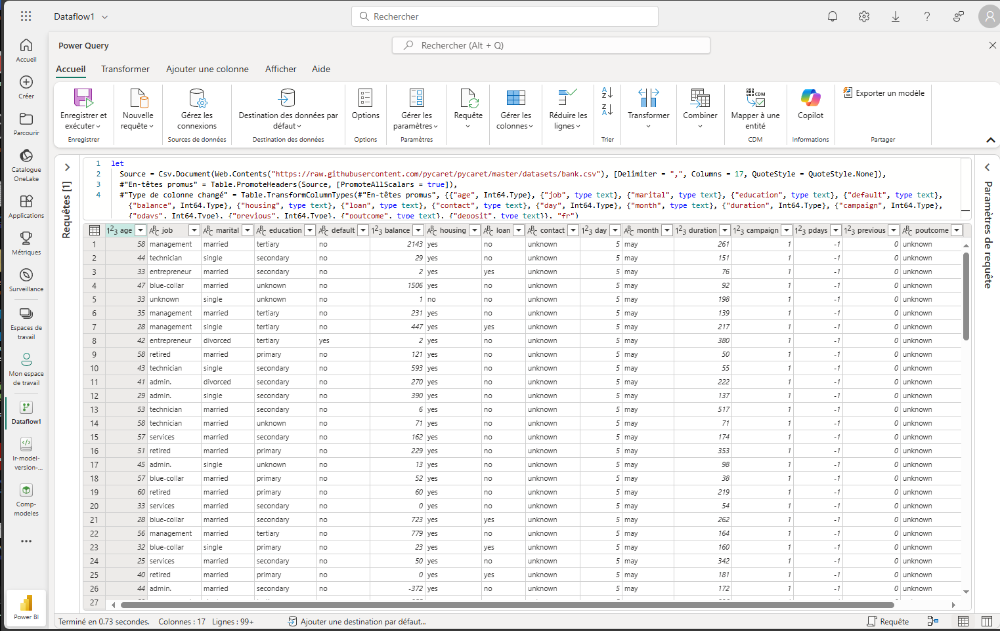
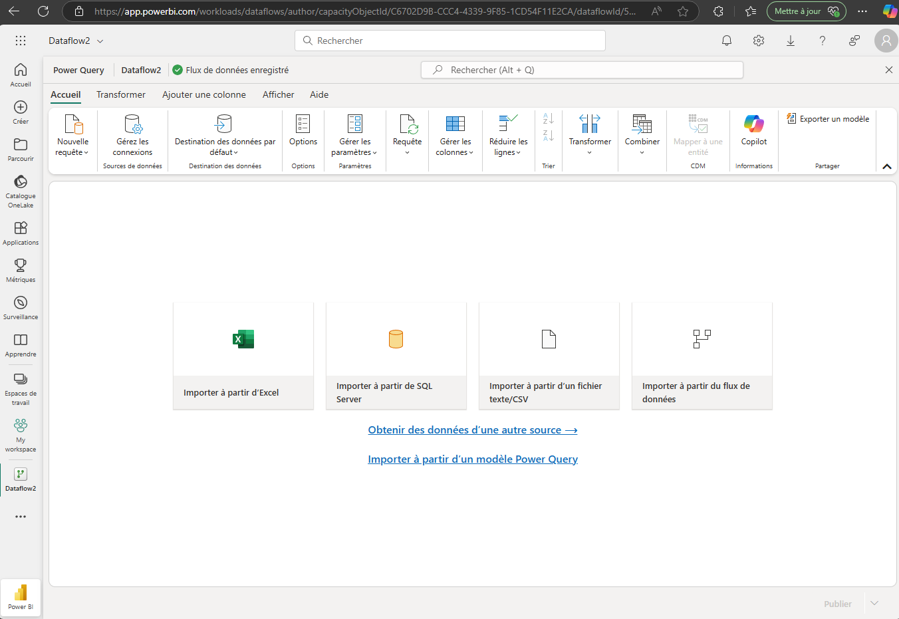
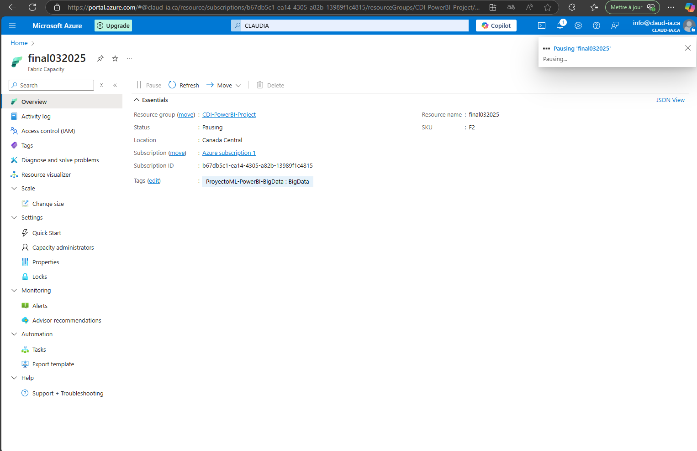

# Utilisation de Power BI Embedded Generation 2 avec Azure

Ce document décrit les étapes essentielles pour intégrer et utiliser **Power BI Embedded Generation 2** dans un projet Azure.

## 🌐 Introduction

Power BI Embedded Generation 2 offre une meilleure **scalabilité**, un suivi plus efficace de l'utilisation, et des performances accrues pour l'affichage et la gestion des rapports Power BI.

---

## 🚀 Déploiement du projet dans Azure

### 1. Création de la ressource Power BI Embedded


- Abonnement : Azure Subscription 1
- Groupe de ressources : CDI-PowerBI-Project
- Emplacement : Canada Central
- Nom de la ressource : `final032025`
- Taille : `A1` (1 v-core, 3 Go de mémoire)

> ⚠️ **Attention** : L'étape de validation peut échouer si certaines informations de base sont manquantes.

### 2. Détails de la ressource


- Statut : Actif
- Mode de ressource : Embedded Generation 2
- Administrateur : info@claud-ia.ca

### 3. Coûts mensuels estimés


La tarification varie selon la taille (SKU) choisie. Exemple :
- `A1` : 750,03 $US/mois
- `A2` : 1494,03 $US/mois
- `A8` : jusqu'à 95 977,79 $US/mois

---

## 📊 Intégration avec Power BI Service

### Chargement et transformation des données avec Power Query

#### 📥 Étape 1 : Créer un flux de données Gen2


Sélectionner « Flux de données Gen2 » dans la création d'article pour préparer, nettoyer et transformer les données.

#### 🧾 Étape 2 : Nommer le flux de données


Donner un nom explicite au flux pour une meilleure organisation. Exemple : `Dataflow 1`.

#### 🗃️ Étape 3 : Choisir la source de données


Power BI vous propose plusieurs connecteurs : Excel, SQL Server, SharePoint, Texte/CSV, Dataverse, etc.

#### 🔌 Étape 4 : Connexion via fichier CSV (URL)


Insérer l’URL directe vers le fichier CSV. Exemple :
```
https://raw.githubusercontent.com/pycaret/pycaret/master/datasets/bank.csv
```

#### 🧰 Étape 5 : Schéma et types de données


Affichage visuel du schéma, noms de colonnes et types détectés. Utiliser l'éditeur avancé pour personnaliser les transformations.

#### 🛠️ Étape 6 : Transformer les données


- Modifier les types (entiers, texte, etc.)
- Filtrer, grouper, renommer les colonnes
- Appliquer des règles métier

#### 🏠 Étape 7 : Vue d'ensemble dans le menu Accueil


Depuis l'onglet Accueil, vous pouvez gérer les connexions, enregistrer et exécuter votre flux, ou encore exporter un modèle.

#### ⚙️ Étape 8 : Détection des types


Activez la détection automatique des types de colonnes et entêtes pour accélérer la préparation des données.

#### 🧭 Étape 9 : Interface principale de Power Query


Vue centrale pour manipuler et transformer les données. Possibilité d'importer depuis un modèle Power Query existant.

#### ⏸️ Étape 10 : Mise en pause de la capacité Fabric (optionnel)


Dans le portail Azure, vous pouvez mettre en pause la capacité Fabric pour réduire les coûts hors période d’utilisation.


